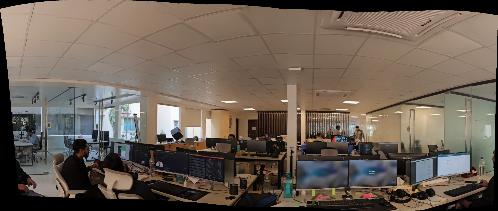

# Pano-Py: Video Panorama Creator

This Python script extracts frames from a video file and stitches them into a panorama image using OpenCV.

## Features
- Extracts evenly spaced frames from a video.
- Creates a panorama by stitching the frames together.
- Saves the resulting panorama as an image file.

## Installation
1. Clone the repository:
    ```bash
    git clone https://github.com/FahimFBA/pano-py.git
    cd pano-py
    ```
2. Install the required dependencies:
    ```bash
    pip install -r requirements.txt
    ```

## Usage
1. Place your video file in the same directory as the script or provide the path to the video.
2. Update the `video_path` variable in the script with the path to your video file.
3. Run the script:
    ```bash
    python main.py
    ```
4. The panorama image will be saved as `panorama_result.jpg` in the current directory.

## Input and Output
| Input Video (`video.mp4`) | Output Panorama (`panorama_result.jpg`) |
|---------------------------|-------------------------------------------|
|  |  |


## Functions
### `load_frames(video_path, num_frames=20)`
Extracts a specified number of frames evenly spaced from the video.

- **Parameters:**
  - `video_path` (str): Path to the video file.
  - `num_frames` (int): Number of frames to extract.
- **Returns:** A list of frames as numpy arrays.

### `create_panorama(frames)`
Creates a panorama by stitching together a list of frames.

- **Parameters:**
  - `frames` (list): A list of frames to stitch together.
- **Returns:** The stitched panorama image as a numpy array, or `None` if stitching fails.

## Requirements
- Python 3.8 or above
- OpenCV
- NumPy

## Example Output
The script extracts frames from the video and creates a panorama. The generated panorama is saved as `panorama_result.jpg`.

## License
This project is licensed under the MIT License. See the [LICENSE](LICENSE) file for details.
